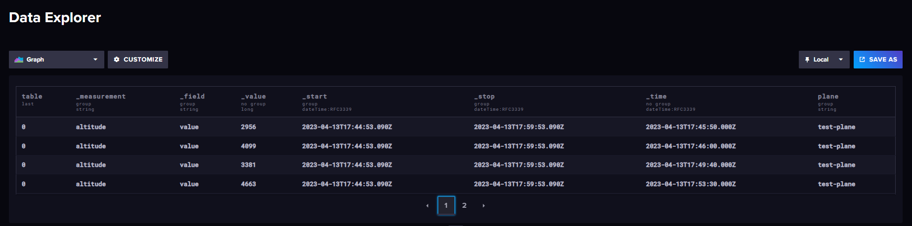

# InfluxApp

## Short description:
This is my example of an application that automatically generates a message every 5 seconds in runtime mode and pushes it to the Influx database,
then you can read the data from there using the API get in Swagger.
The application is simplified deliberately and considered as a step for a more serious development of my future project.

## Introduction to Influx database:
InfluxDB is a high-performance, distributed, and scalable database designed for handling large volumes of time-stamped data. It provides an intuitive query language, a user-friendly web interface, and extensive client libraries that enable developers to easily build applications that process real-time data.

## Core Influx database features:
1. Fast and efficient: InfluxDB is designed to handle high write and query loads, with low-latency performance that scales to meet the demands of large-scale data processing.
2. Scalable: InfluxDB is built to handle large volumes of data, with a distributed architecture that enables horizontal scaling across multiple nodes.
3. Time series data handling: InfluxDB is optimized for time series data, with specialized indexing and compression algorithms that enable efficient storage and retrieval of time-stamped data.
4. Flexible data model: InfluxDB provides a flexible data model that can accommodate a wide range of data types, including numerical, textual, and binary data.
5. Query language: InfluxDB provides an intuitive query language that enables developers to quickly and easily retrieve data from the database.
6. Data visualization: InfluxDB comes with a user-friendly web interface that provides powerful data visualization and exploration tools, including graphs, charts, and dashboards.